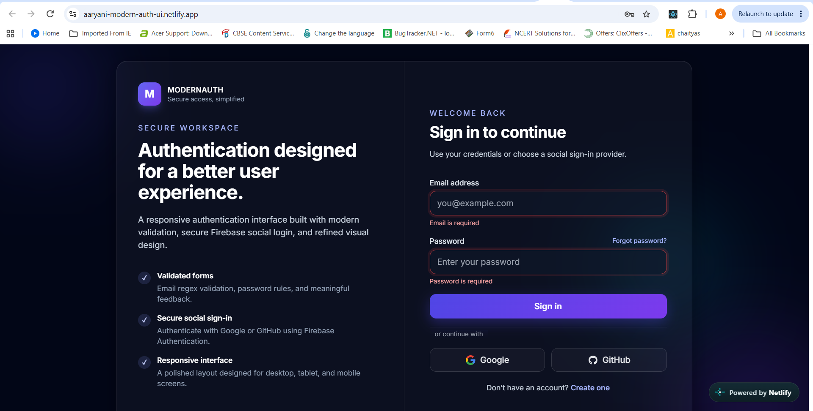
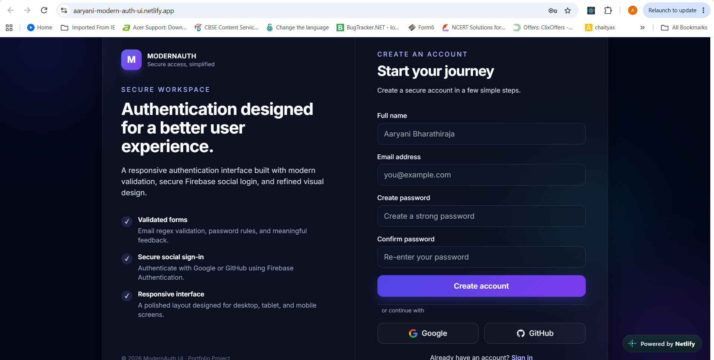
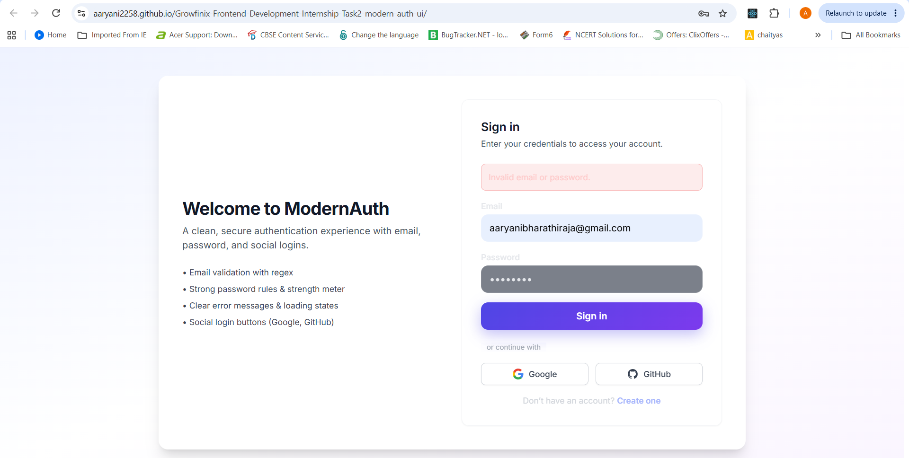
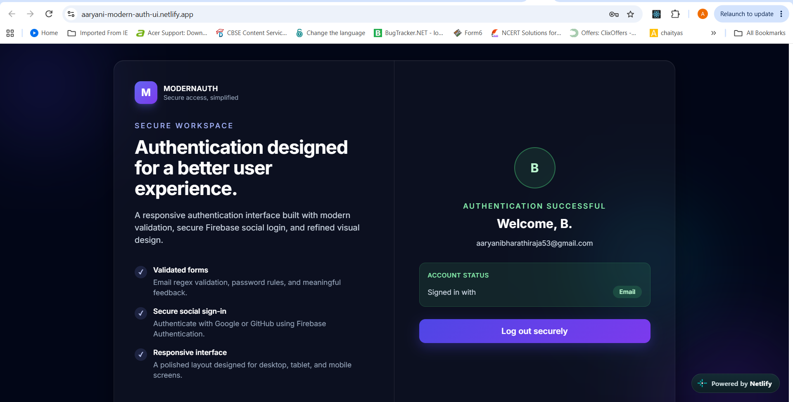

# Modern Authentication UI

A modern, responsive authentication user interface built with React, Tailwind CSS, React Hook Form, and Firebase Authentication.

This project provides a polished login and registration experience with form validation, password-strength feedback, error handling, and social authentication through Google and GitHub.



---

## Live Demo

> Add your deployed project link here after deployment.

[View Live Demo](https://aaryani-modern-auth-ui.netlify.app/)

---

## Features

- Responsive login and registration interface
- Modern glassmorphism-inspired user interface
- Animated background gradients and visual effects
- Email validation using regular expressions
- Strong password validation rules
- Password-strength indicator
- Confirm-password validation
- Clear inline error messages
- Loading states during form submission
- Google authentication with Firebase
- GitHub authentication with Firebase
- Authenticated user profile display
- Logout functionality
- Reusable React components
- Mobile-friendly responsive layout

---

## Screenshots

### Login Page


### Registration Page



### Form Validation



### Authenticated User



---

## Tech Stack

| Technology | Purpose |
|---|---|
| React | Building the user interface |
| JavaScript | Application logic |
| Vite | Development server and build tool |
| Tailwind CSS v3 | Responsive utility-first styling |
| Custom CSS | Glassmorphism effects, animations, and custom components |
| React Hook Form | Form state management and validation |
| Firebase Authentication | User authentication and auth-state management |
| Google OAuth | Google social login |
| GitHub OAuth | GitHub social login |

---

## Form Validation

The application uses React Hook Form for efficient form handling and validation.

### Email validation

The email field uses the following regular expression:

```js
/^[^\s@]+@[^\s@]+\.[^\s@]+$/
```

This checks that the email contains:

- Text before the `@` symbol
- A valid domain name
- A domain extension such as `.com`, `.in`, or `.org`

### Password validation

The registration form requires a password with:

- At least 8 characters
- At least one uppercase letter
- At least one number
- At least one special character

Example of a valid password:

```text
Password1!
```

### Password strength meter

The password strength meter checks four conditions:

1. Password has at least 8 characters
2. Password contains an uppercase letter
3. Password contains a number
4. Password contains a special character

The visual indicator updates while the user types.

---

## Authentication

Firebase Authentication is used to support social login for different users.

### Supported providers

- Google
- GitHub

Any user visiting the website can choose their own Google account or GitHub account to sign in.

After successful login, the app displays:

- User name
- User email
- Authentication provider
- Logout button

---

## Installation

### 1. Clone the repository

```bash
git clone [https://github.com/your-username/modern-auth-ui.git](https://github.com/your-username/modern-auth-ui.git)
```

### 2. Open the project folder

```bash
cd modern-auth-ui
```

### 3. Install dependencies

```bash
npm install
```

If dependencies are not already included, install them with:

```bash
npm install react-hook-form firebase
npm install -D tailwindcss@3 postcss autoprefixer
```

### 4. Start the development server

```bash
npm run dev
```

Open the local URL shown in the terminal, usually:

```text
http://localhost:5173
```

---

## Firebase Setup

To enable Google and GitHub login, create a Firebase project and add your Firebase configuration.

### 1. Create a Firebase project

1. Go to [Firebase Console](https://console.firebase.google.com/)
2. Create a new Firebase project
3. Add a Web application
4. Copy the Firebase configuration object

### 2. Enable authentication providers

In Firebase Console:

1. Open **Build**
2. Open **Authentication**
3. Select **Sign-in method**
4. Enable **Google**
5. Enable **GitHub**
6. Save the provider settings

### 3. Update `src/firebase.js`

Replace the placeholder values in `src/firebase.js` with the values from your Firebase project:

```js
const firebaseConfig = {
  apiKey: "YOUR_API_KEY",
  authDomain: "YOUR_PROJECT_ID.firebaseapp.com",
  projectId: "YOUR_PROJECT_ID",
  storageBucket: "YOUR_PROJECT_ID.appspot.com",
  messagingSenderId: "YOUR_MESSAGING_SENDER_ID",
  appId: "YOUR_APP_ID",
};
```

> Do not upload private Firebase credentials, service-account keys, or GitHub client secrets to a public repository.

---

## GitHub OAuth Setup

To enable GitHub sign-in:

1. Go to Firebase Authentication.
2. Enable the GitHub provider.
3. Copy the callback URL displayed by Firebase.
4. Go to [GitHub Developer Settings](https://github.com/settings/developers).
5. Create a new OAuth App.
6. Paste the Firebase callback URL into the **Authorization callback URL** field.
7. Copy the GitHub Client ID and Client Secret.
8. Paste them into the GitHub provider settings in Firebase.
9. Save the changes.

---

## Folder Structure

```text
src/
│
├── components/
│   ├── LoginForm.jsx         # Login form and validation
│   ├── RegisterForm.jsx      # Registration form and password checks
│   └── SocialButtons.jsx     # Google and GitHub login buttons
│
├── App.jsx                   # Main application and auth-state UI
├── firebase.js               # Firebase configuration and auth helpers
├── index.css                 # Tailwind directives and custom styling
└── main.jsx                  # React entry point
```

---

## Key Learning Outcomes

Through this project, I learned how to:

- Build reusable React components
- Handle controlled forms with React Hook Form
- Validate user input using regex and custom rules
- Build password-strength feedback
- Manage form errors and loading states
- Integrate Firebase Authentication
- Implement Google OAuth login
- Implement GitHub OAuth login
- Track authentication state in React
- Create responsive layouts using Tailwind CSS
- Build a polished UI using custom CSS animations and glassmorphism effects

---

## Future Improvements

- Add Firebase email/password registration and login
- Add a forgot-password workflow
- Add email verification after registration
- Add protected dashboard routes
- Store user profiles in Firebase Firestore
- Add dark/light theme switching
- Add accessibility improvements for keyboard and screen-reader users
- Add automated tests for validation logic
- Deploy the project using Vercel, Netlify, or Firebase Hosting

---

## Author

**Aaryani Bharathiraja**

- GitHub: [your-github-username](https://github.com/aaryani2258)
- LinkedIn: [your-linkedin-profile](https://www.linkedin.com/in/aaryani-bharathiraja-08580137a/)

---

## License

This project is created for learning, internship, and portfolio purposes.
